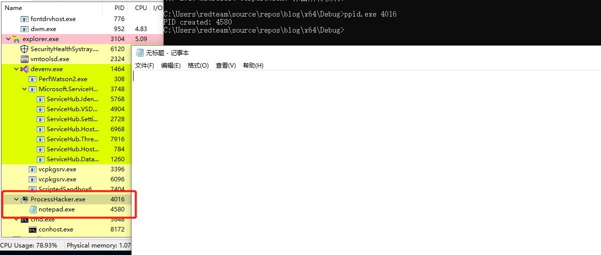
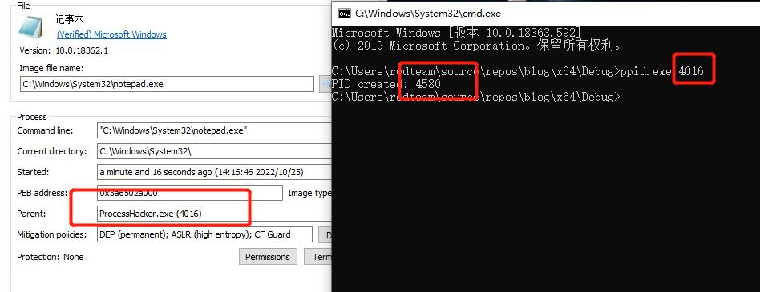

## 0X00 PPID欺骗介绍

在我们使用CreateProcess API时，默认情况下，最后的进程将作为调用方的子进程生成。然而，"PPID欺骗"技术允许调用者更改派生进程的父进程。所以如果我们的beacon运行在powershell中，我们可以就将进程派生到一个完全不同的进程的子进程中，比如explorer.exe 。

这将导致Sysmon等应用程序记录新父级下的进程创建。当一个beacon在一个不合法的进程中运行(例如横向移动或其他一些漏洞传递)，并且进程创建事件会被杀软检测或被完全阻止，那么这个方法就有了其作用。

## 0x01 技术实现

这个技术是在[STARTUPINFOEX](https://learn.microsoft.com/zh-cn/windows/win32/api/winbase/ns-winbase-startupinfoexw) 结构中实现的，这个结构具有LPPROC_THEAD_ATTRIBUTE_LIST属性。这允许我们向CreateProcess调用传递附加属性。对于PPID欺骗，我们关注的PROC_THREAD_ATTRIBUTE_PARENT_PROCESS。lpValue参数是指向要使用的进程句柄的指针，而不是将调用进程用作正在创建的进程的父进程。要使用的进程必须具有process_CREATE_process访问权限。 

下面用一段简短的代码来实现获取父进程PID和初始化

```c
#include <iostream>
#include <Windows.h>
#include <winternl.h>

int main(int argc, const char* argv[])
{
	//获取父进程PID
	DWORD parentPid = atoi(argv[1]);

	//初始化
	STARTUPINFOEX sie = { sizeof(sie) };
}
```

我们需要先知道所需的大小，然后分配一个内存区域来保存属性列表。这个列表可以有多个属性，但由于我们只对PROC_THREAD_ATTRIBUTE_PARENT_PROCESS感兴趣，因此大小为1。所以我们调用InitializeProcThreadAttributeList并提供NULL目标，但lpSize变量将填充我们需要的大小。因为这个API返回bool，所以这个调用也将始终返回FALSE。

```c
SIZE_T lpSize;
InitializeProcThreadAttributeList(NULL, 1, 0, &lpSize);
```

接下来我们使用malloc在STARTUPINFOEX的lpAttributeList属性上分配内存区域。我们再次调用InitializeProcThreadAttributeList，它应该返回TRUE。

```c
//为STARTUPINFOEX上的属性列表分配内存
sie.lpAttributeList = (PPROC_THREAD_ATTRIBUTE_LIST)malloc(lpSize);

//再次调用InitializeProcThreadAttributeList，此时应返回TRUE
if (!InitializeProcThreadAttributeList(sie.lpAttributeList, 1, 0, &lpSize))
{
	printf("InitializeProcThreadAttributeList failed. Error code: %d.\n", GetLastError());
	return 0;
}
```

获取父进程的句柄并将其传递到UpdateProcThreadAttribute的调用中。 

```c
//获取进程的句柄以充当父进程
HANDLE hParentProcess = OpenProcess(PROCESS_ALL_ACCESS, FALSE, parentPid);

//调用UpdateProcThreadAttribute
if (!UpdateProcThreadAttribute(sie.lpAttributeList, 0, PROC_THREAD_ATTRIBUTE_PARENT_PROCESS, &hParentProcess, sizeof(HANDLE), NULL, NULL))
{
	printf("UpdateProcThreadAttribute failed. Error code: %d.\n", GetLastError());
	return 0;
}
```

剩下要做的就是调用CreateProcess，确保传递EXTENDED_STARTUPINFO_PRESENT

```c
//调用CreateProcess并传递EXTENDED_STARTUPINFO_PRESENT
PROCESS_INFORMATION pi;

if (!CreateProcess(
	L"C:\\Windows\\System32\\notepad.exe",
	NULL,
	0,
	0,
	FALSE,
	EXTENDED_STARTUPINFO_PRESENT,
	NULL,
	L"C:\\Windows\\System32",
	&sie.StartupInfo,
	&pi))
{
	printf("CreateProcess failed. Error code: %d.\n", GetLastError());
	return 0;
}

printf("PID created: %d", pi.dwProcessId);
return 1;
```

## 0x02  实现效果






## 0x03 小结

本文介绍了PPID欺骗实现原理以及怎么用Windows API 去实现

### 注：本文仅用于安全研究和学习之用